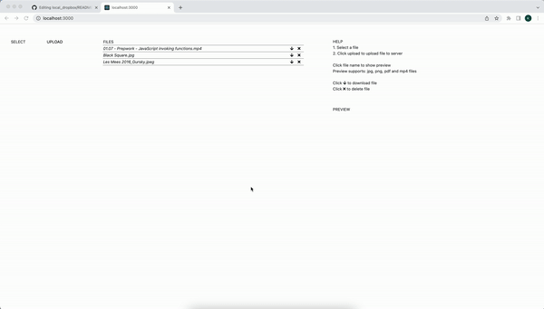
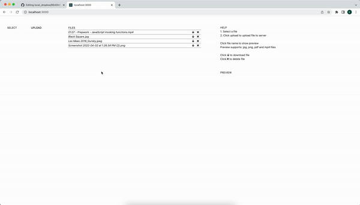
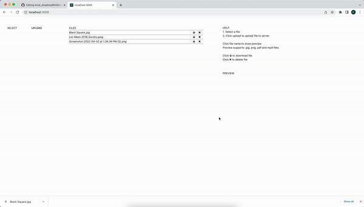

# Local Dropbox
This project sets up a local server and allows the user to upload and store files from the server. Additional features also allows the user to download and delete files from the server.







## Installation
1. Open CLI
2. Clone the repo
3. ```cd``` into cloned repo
4. Execute: ```npm install```
5. Execute: ```node app.js```
6. Open "localhost:3000" in browser

## Help
- "Select" to select files for upload
- "Upload" to upload selected files to server
- Click file name to show a preview of the file (supports jpg, png, pdf and mp4 files with proper file extension on file name)
- Click the down arrow to download a file
- Click the cross to delete a file
